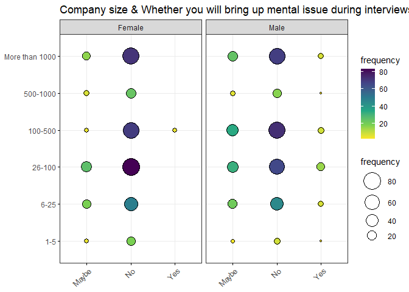
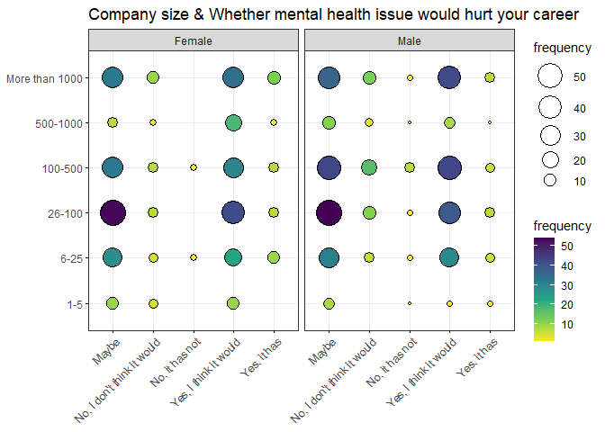
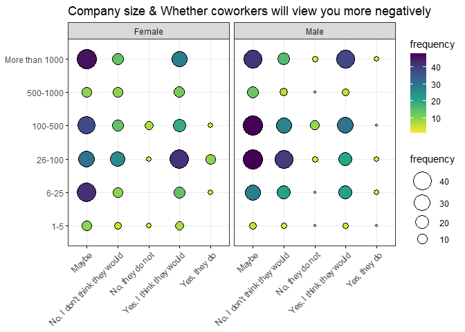
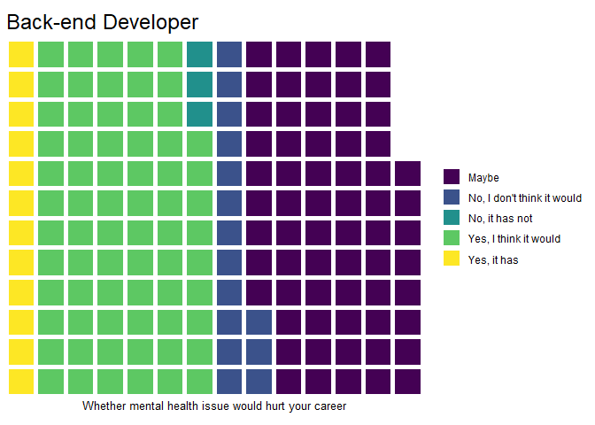
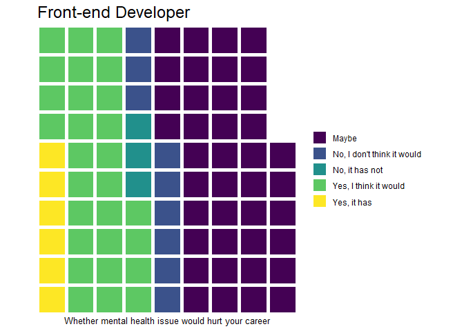
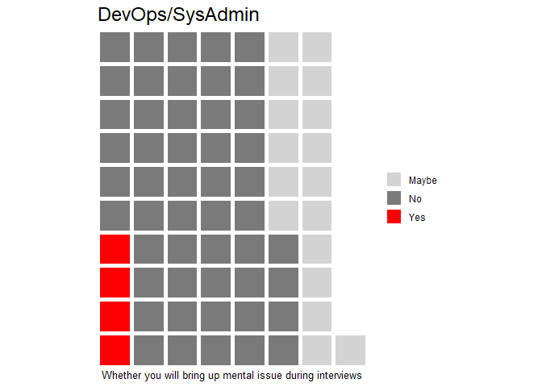
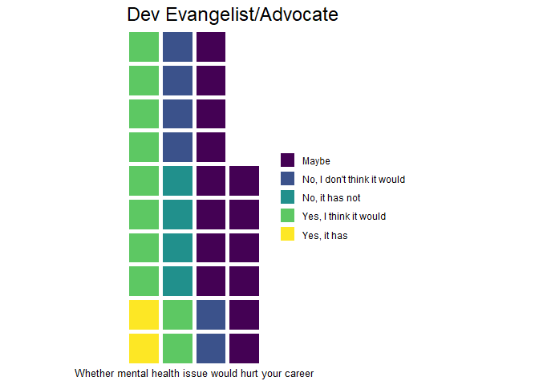

```r
library(dplyr)
library(forcats)
library(ggplot2)
library(data.table)
library(ggpubr)
setwd("C:/Users/Admin/Desktop")
mental <- read.csv('mental-heath-in-tech-2016_20161114.csv', header = TRUE,encoding = "UTF-8")
```


```r
head(arrange(plyr::count(mental, 'What.is.your.gender.'),desc(freq)),20)
```

```
##    What.is.your.gender. freq
## 1                  Male  337
## 2                  male  134
## 3                Female  111
## 4                female   70
## 5                     M   49
## 6                     m   42
## 7                     F   31
## 8                     f   16
## 9               Female     7
## 10                Male     4
## 11                woman    4
## 12                Woman    3
## 13              female     2
## 14           Male (cis)    2
## 15           non-binary    2
## 16                         1
## 17               Female    1
## 18                 AFAB    1
## 19              Agender    1
## 20            Cis-woman    1
```

```r
#arrange gender column
mental$What.is.your.gender.[mental$What.is.your.gender. == "male"] <- "Male"
mental$What.is.your.gender.[mental$What.is.your.gender. == "M"] <- "Male"
mental$What.is.your.gender.[mental$What.is.your.gender. == "m"] <- "Male"
mental$What.is.your.gender.[mental$What.is.your.gender. == "Male "] <- "Male"
mental$What.is.your.gender.[mental$What.is.your.gender. == "Male (cis)"] <- "Male"
mental$What.is.your.gender.[mental$What.is.your.gender. == "female"] <- "Female"
mental$What.is.your.gender.[mental$What.is.your.gender. == "Female "] <- "Female"
mental$What.is.your.gender.[mental$What.is.your.gender. == "F"] <- "Female"
mental$What.is.your.gender.[mental$What.is.your.gender. == "f"] <- "Female"
mental$What.is.your.gender.[mental$What.is.your.gender. == "woman"] <- "Female"
mental$What.is.your.gender.[mental$What.is.your.gender. == "Woman"] <- "Female"
mental$What.is.your.gender.[mental$What.is.your.gender. == "female "] <- "Female"
mental <- mental %>% filter(What.is.your.gender.== "Male" | What.is.your.gender.== "Female")
setnames(mental, "What.is.your.gender.", "gender")
arrange(plyr::count(mental, 'gender'),desc(freq))
```

```
##   gender freq
## 1   Male  568
## 2 Female  244
```


```r
#change names
setnames(mental, "Did.you.hear.of.or.observe.negative.consequences.for.co.workers.with.mental.health.issues.in.your.previous.workplaces.", "consequences_coworkers")
mental <- mental %>% filter(consequences_coworkers!="")
setnames(mental, "Would.you.bring.up.a.mental.health.issue.with.a.potential.employer.in.an.interview.", "bringup_issue")
setnames(mental, "Do.you.feel.that.being.identified.as.a.person.with.a.mental.health.issue.would.hurt.your.career.", "mental_hurt_career")
setnames(mental,"Do.you.think.that.team.members.co.workers.would.view.you.more.negatively.if.they.knew.you.suffered.from.a.mental.health.issue.","coworker_views")
setnames(mental,"How.many.employees.does.your.company.or.organization.have.","company_size")
setnames(mental,"What.is.your.age.","age")
```


```r
arrange(plyr::count(mental, 'gender'),desc(freq))
```

```
##   gender freq
## 1   Male  511
## 2 Female  218
```

```r
arrange(plyr::count(mental$'consequences_coworkers'),desc(freq))
```

```
##                  x freq
## 1     None of them  437
## 2     Some of them  261
## 3 Yes, all of them   31
```

```r
arrange(plyr::count(mental$'bringup_issue'),desc(freq))
```

```
##       x freq
## 1    No  490
## 2 Maybe  190
## 3   Yes   49
```

```r
arrange(plyr::count(mental$'mental_hurt_career'),desc(freq))
```

```
##                            x freq
## 1                      Maybe  302
## 2      Yes, I think it would  282
## 3 No, I don't think it would   71
## 4                Yes, it has   55
## 5             No, it has not   19
```

```r
arrange(plyr::count(mental$'coworker_views'),desc(freq))
```

```
##                              x freq
## 1                        Maybe  303
## 2      Yes, I think they would  217
## 3 No, I don't think they would  164
## 4              No, they do not   25
## 5                 Yes, they do   20
```

```r
mental <-mental %>% filter(age!=323)#delete error
arrange(plyr::count(mental$'age'),desc(x))
```

```
##     x freq
## 1  70    1
## 2  66    1
## 3  65    1
## 4  63    4
## 5  61    2
## 6  59    2
## 7  58    1
## 8  57    3
## 9  56    3
## 10 55    6
## 11 54    4
## 12 53    2
## 13 52    6
## 14 51    5
## 15 50    4
## 16 49    9
## 17 48    5
## 18 47    9
## 19 46   10
## 20 45   14
## 21 44   18
## 22 43   14
## 23 42   16
## 24 41   10
## 25 40   25
## 26 39   32
## 27 38   23
## 28 37   28
## 29 36   31
## 30 35   40
## 31 34   39
## 32 33   37
## 33 32   42
## 34 31   38
## 35 30   55
## 36 29   42
## 37 28   32
## 38 27   23
## 39 26   31
## 40 25   21
## 41 24   13
## 42 23    7
## 43 22   10
## 44 21    6
## 45 20    1
## 46 19    2
```

```r
mental$company_size[mental$company_size == "6.25"] <- "6-25"
mental$company_size[mental$company_size == "1.5"] <- "1-5"
mental <- mental %>% filter(company_size!="")#delete blank value
mental <- mental %>% mutate(company_size = fct_relevel(company_size, 
            "1-5", "6-25", "26-100", 
            "100-500", "500-1000", "More than 1000"))#reorder the company size
plyr::count(mental$'company_size')
```

```
##                x freq
## 1            1-5   23
## 2           6-25  102
## 3         26-100  160
## 4        100-500  149
## 5       500-1000   38
## 6 More than 1000  138
```


```r
mental1 <- mental %>% filter(gender == 'Male')%>%
          dplyr::group_by(company_size,gender, bringup_issue) %>%
          dplyr::summarise(frequency=n())%>%
          dplyr::mutate(frequency_ratio = frequency / sum(frequency)*100)
```

```
## `summarise()` has grouped output by 'company_size', 'gender'. You can override using the `.groups` argument.
```

```r
mental2 <- mental %>% filter(gender == 'Female')%>%
          dplyr::group_by(company_size,gender, bringup_issue) %>%
          dplyr::summarise(frequency=2.32*n())%>%#times male/female ratio
          dplyr::mutate(frequency_ratio = frequency / sum(frequency)*100)
```

```
## `summarise()` has grouped output by 'company_size', 'gender'. You can override using the `.groups` argument.
```

```r
mental3 <- rbind(mental1, mental2)
fig<- ggballoonplot(mental3, y = "company_size", x = "bringup_issue", size="frequency",fill = "frequency",
             facet.by = "gender", ggtheme = theme_bw())+
  scale_fill_viridis_c(option = "C")
fig <-  ggpar(fig,main = "Company size & Whether you will bring up mental issue during interviews", xlab = "Answer", ylab = "Company size")
fig
```

<!-- -->


```r
mental4 <- mental %>% filter(gender == 'Male')%>%
          dplyr::group_by(company_size,gender, mental_hurt_career) %>%
          dplyr::summarise(frequency=n())%>%
          dplyr::mutate(frequency_ratio = frequency / sum(frequency)*100)
```

```
## `summarise()` has grouped output by 'company_size', 'gender'. You can override using the `.groups` argument.
```

```r
mental5 <- mental %>% filter(gender == 'Female')%>%
          dplyr::group_by(company_size,gender, mental_hurt_career) %>%
          dplyr::summarise(frequency=2.32*n())%>%#times male/female ratio
          dplyr::mutate(frequency_ratio = frequency / sum(frequency)*100)
```

```
## `summarise()` has grouped output by 'company_size', 'gender'. You can override using the `.groups` argument.
```

```r
mental6 <- rbind(mental4, mental5)
fig2<- ggballoonplot(mental6, y = "company_size", x = "mental_hurt_career", fill = "frequency", size="frequency",
             facet.by = "gender", ggtheme = theme_bw())+
  scale_fill_viridis_c(option = "C")
fig2 <-  ggpar(fig2,main = "Company size & Whether mental health issue would hurt your career", xlab = "Answer", ylab = "Company size")

fig2
```

<!-- -->


```r
mental7 <- mental %>% filter(gender == 'Male')%>%
          dplyr::group_by(company_size,gender, coworker_views) %>%
          dplyr::summarise(frequency=n())%>%
          dplyr::mutate(frequency_ratio = frequency / sum(frequency)*100)
```

```
## `summarise()` has grouped output by 'company_size', 'gender'. You can override using the `.groups` argument.
```

```r
mental8 <- mental %>% filter(gender == 'Female')%>%
          dplyr::group_by(company_size,gender, coworker_views) %>%
          dplyr::summarise(frequency=2.32*n())%>%#times male/female ratio
          dplyr::mutate(frequency_ratio = frequency / sum(frequency)*100)
```

```
## `summarise()` has grouped output by 'company_size', 'gender'. You can override using the `.groups` argument.
```

```r
mental9 <- rbind(mental7, mental8)
fig3<- ggballoonplot(mental9, y = "company_size", x = "coworker_views", fill = "frequency", size="frequency",
             facet.by = "gender", ggtheme = theme_bw())+
  scale_fill_viridis_c(option = "C")
fig3 <-  ggpar(fig3,main = "Company size & Whether coworkers will view you more negatively", xlab = "Answer", ylab = "Company size")
fig3
```

<!-- -->


Waffle Chart Based on Work Positions

```r
library(stringr)
library(waffle)
```

```
## Warning: package 'waffle' was built under R version 4.0.5
```

```r
library(viridis)
```

```
## Loading required package: viridisLite
```

```r
setnames(mental,"Which.of.the.following.best.describes.your.work.position.","work_position_general")

work_position <- mental$work_position_general
work_position <- word(work_position,1,sep = "\\|")
work_position <- as.data.frame(work_position)
mental <- cbind(mental, work_position)
arrange(plyr::count(mental, 'work_position'),desc(freq))
```

```
##              work_position freq
## 1       Back-end Developer  164
## 2     Supervisor/Team Lead  102
## 3      Front-end Developer   86
## 4                    Other   81
## 5          DevOps/SysAdmin   71
## 6  Dev Evangelist/Advocate   36
## 7                  Support   34
## 8     Executive Leadership   23
## 9                 Designer    9
## 10         One-person shop    2
## 11                      HR    1
## 12                   Sales    1
```

```r
#arrange by job types
mental_wp_back <- mental %>% dplyr::filter(work_position== "Back-end Developer") %>% dplyr::select(mental_hurt_career, work_position)
back <- table(mental_wp_back$mental_hurt_career)
back_w <- waffle(back, rows = 12, xlab="Whether mental health issue would hurt your career",colors = viridis::viridis(5),reverse=TRUE) +
  ggtitle("Back-end Developer")
back_w
```

<!-- -->

```r
mental_wp_front <- mental%>% dplyr::filter(work_position== "Front-end Developer") %>% dplyr::select(mental_hurt_career, work_position)                
front <- table(mental_wp_front$mental_hurt_career)
front_w <- waffle(front, rows = 10, xlab="Whether mental health issue would hurt your career",colors = viridis::viridis(5),reverse=TRUE)+
  ggtitle("Front-end Developer")
front_w
```

<!-- -->

```r
mental_wp_lead <- mental %>% dplyr::filter(work_position== "Supervisor/Team Lead")%>% dplyr::select(mental_hurt_career, work_position)
lead <- table(mental_wp_lead$mental_hurt_career)
lead_w <- waffle(lead, rows = 10, xlab="Whether mental health issue would hurt your career",colors = viridis::viridis(5),reverse=TRUE)+
  ggtitle("Supervisor/Team Lead")
lead_w
```

<!-- -->

```r
mental_wp_devops <- mental %>% dplyr::filter(work_position== "DevOps/SysAdmin")%>% dplyr::select(mental_hurt_career, work_position)
devops<- table(mental_wp_devops$mental_hurt_career)
devops_w <- waffle(devops, rows = 10, xlab="Whether mental health issue would hurt your career",colors = viridis::viridis(4),reverse=TRUE)+
  ggtitle("DevOps/SysAdmin")
devops_w 
```

<!-- -->

```r
mental_wp_advocate <- mental %>% dplyr::filter(work_position== "Dev Evangelist/Advocate")%>% dplyr::select(mental_hurt_career, work_position)
advocate<- table(mental_wp_advocate$mental_hurt_career)
advocate_w <- waffle(advocate, rows = 10, xlab="Whether mental health issue would hurt your career",colors = viridis::viridis(5),reverse=TRUE)+
  ggtitle("Dev Evangelist/Advocate")
advocate_w
```

<!-- -->


