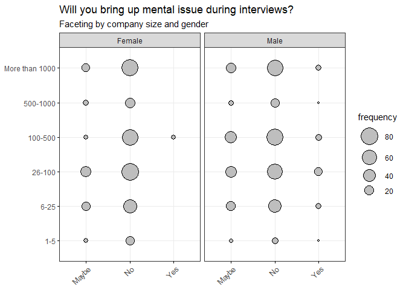
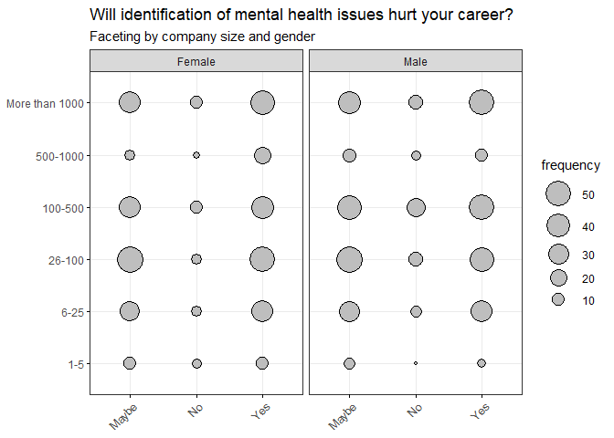
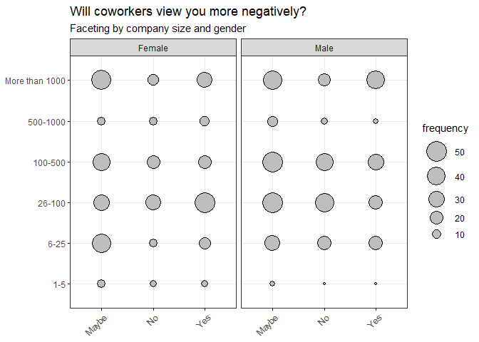
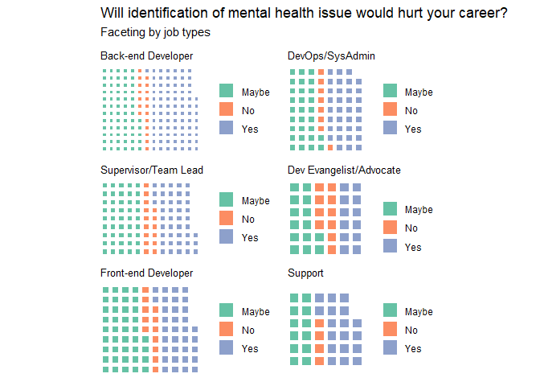
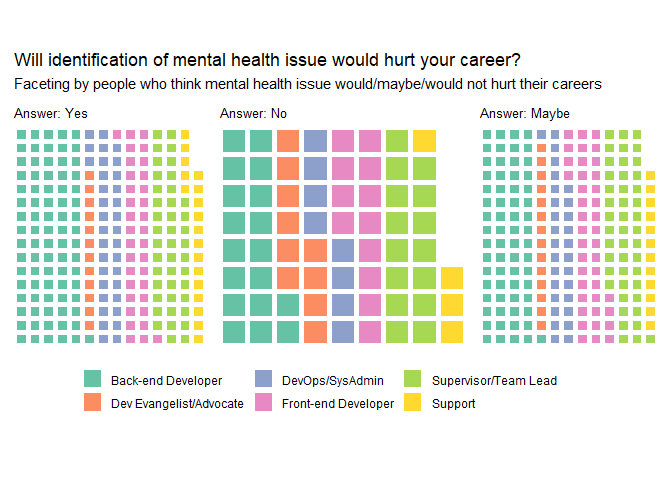

```r
library(dplyr)
library(forcats)
library(ggplot2)
library(data.table)
library(ggpubr)
library(patchwork)
setwd("C:/Users/Admin/Desktop")
mental <- read.csv('mental-heath-in-tech-2016_20161114.csv', header = TRUE,encoding = "UTF-8")
```


```r
head(arrange(plyr::count(mental, 'What.is.your.gender.'),desc(freq)),20)
```

```
##    What.is.your.gender. freq
## 1                  Male  337
## 2                  male  134
## 3                Female  111
## 4                female   70
## 5                     M   49
## 6                     m   42
## 7                     F   31
## 8                     f   16
## 9               Female     7
## 10                Male     4
## 11                woman    4
## 12                Woman    3
## 13              female     2
## 14           Male (cis)    2
## 15           non-binary    2
## 16                         1
## 17               Female    1
## 18                 AFAB    1
## 19              Agender    1
## 20            Cis-woman    1
```

```r
#arrange gender column
class(mental$What.is.your.gender.)
```

```
## [1] "character"
```

```r
mental$What.is.your.gender.[mental$What.is.your.gender. == "male"] <- "Male"
mental$What.is.your.gender.[mental$What.is.your.gender. == "M"] <- "Male"
mental$What.is.your.gender.[mental$What.is.your.gender. == "m"] <- "Male"
mental$What.is.your.gender.[mental$What.is.your.gender. == "Male "] <- "Male"
mental$What.is.your.gender.[mental$What.is.your.gender. == "Male (cis)"] <- "Male"
mental$What.is.your.gender.[mental$What.is.your.gender. == "female"] <- "Female"
mental$What.is.your.gender.[mental$What.is.your.gender. == "Female "] <- "Female"
mental$What.is.your.gender.[mental$What.is.your.gender. == "F"] <- "Female"
mental$What.is.your.gender.[mental$What.is.your.gender. == "f"] <- "Female"
mental$What.is.your.gender.[mental$What.is.your.gender. == "woman"] <- "Female"
mental$What.is.your.gender.[mental$What.is.your.gender. == "Woman"] <- "Female"
mental$What.is.your.gender.[mental$What.is.your.gender. == "female "] <- "Female"
mental <- mental %>% filter(What.is.your.gender.== "Male" | What.is.your.gender.== "Female")
setnames(mental, "What.is.your.gender.", "gender")
arrange(plyr::count(mental, 'gender'),desc(freq))
```

```
##   gender freq
## 1   Male  568
## 2 Female  244
```


```r
#change names
setnames(mental, "Did.you.hear.of.or.observe.negative.consequences.for.co.workers.with.mental.health.issues.in.your.previous.workplaces.", "consequences_coworkers")
mental <- mental %>% filter(consequences_coworkers!="")
setnames(mental, "Would.you.bring.up.a.mental.health.issue.with.a.potential.employer.in.an.interview.", "bringup_issue")
setnames(mental, "Do.you.feel.that.being.identified.as.a.person.with.a.mental.health.issue.would.hurt.your.career.", "mental_hurt_career")
setnames(mental,"Do.you.think.that.team.members.co.workers.would.view.you.more.negatively.if.they.knew.you.suffered.from.a.mental.health.issue.","coworker_views")
setnames(mental,"How.many.employees.does.your.company.or.organization.have.","company_size")
setnames(mental,"What.is.your.age.","age")
```


```r
arrange(plyr::count(mental, 'gender'),desc(freq))
```

```
##   gender freq
## 1   Male  511
## 2 Female  218
```

```r
arrange(plyr::count(mental$'consequences_coworkers'),desc(freq))
```

```
##                  x freq
## 1     None of them  437
## 2     Some of them  261
## 3 Yes, all of them   31
```

```r
arrange(plyr::count(mental$'bringup_issue'),desc(freq))
```

```
##       x freq
## 1    No  490
## 2 Maybe  190
## 3   Yes   49
```

```r
arrange(plyr::count(mental$'mental_hurt_career'),desc(freq))
```

```
##                            x freq
## 1                      Maybe  302
## 2      Yes, I think it would  282
## 3 No, I don't think it would   71
## 4                Yes, it has   55
## 5             No, it has not   19
```

```r
arrange(plyr::count(mental$'coworker_views'),desc(freq))
```

```
##                              x freq
## 1                        Maybe  303
## 2      Yes, I think they would  217
## 3 No, I don't think they would  164
## 4              No, they do not   25
## 5                 Yes, they do   20
```

```r
mental <-mental %>% filter(age!=323)#delete error
arrange(plyr::count(mental$'age'),desc(x))
```

```
##     x freq
## 1  70    1
## 2  66    1
## 3  65    1
## 4  63    4
## 5  61    2
## 6  59    2
## 7  58    1
## 8  57    3
## 9  56    3
## 10 55    6
## 11 54    4
## 12 53    2
## 13 52    6
## 14 51    5
## 15 50    4
## 16 49    9
## 17 48    5
## 18 47    9
## 19 46   10
## 20 45   14
## 21 44   18
## 22 43   14
## 23 42   16
## 24 41   10
## 25 40   25
## 26 39   32
## 27 38   23
## 28 37   28
## 29 36   31
## 30 35   40
## 31 34   39
## 32 33   37
## 33 32   42
## 34 31   38
## 35 30   55
## 36 29   42
## 37 28   32
## 38 27   23
## 39 26   31
## 40 25   21
## 41 24   13
## 42 23    7
## 43 22   10
## 44 21    6
## 45 20    1
## 46 19    2
```

```r
mental$company_size[mental$company_size == "6.25"] <- "6-25"
mental$company_size[mental$company_size == "1.5"] <- "1-5"
mental <- mental %>% filter(company_size!="")#delete blank value
mental <- mental %>% mutate(company_size = fct_relevel(company_size, 
            "1-5", "6-25", "26-100", 
            "100-500", "500-1000", "More than 1000"))#reorder the company size 
plyr::count(mental$'company_size')
```

```
##                x freq
## 1            1-5   23
## 2           6-25  102
## 3         26-100  160
## 4        100-500  149
## 5       500-1000   38
## 6 More than 1000  138
```


```r
mental1 <- mental %>% filter(gender == 'Male')%>%
          dplyr::group_by(company_size,gender, bringup_issue) %>%
          dplyr::summarise(frequency=n())%>%
          dplyr::mutate(frequency_ratio = frequency / sum(frequency)*100)

mental2 <- mental %>% filter(gender == 'Female')%>%
          dplyr::group_by(company_size,gender, bringup_issue) %>%
          dplyr::summarise(frequency=2.32*n())%>%#times male/female ratio to make sure male and female are within same sample size
          dplyr::mutate(frequency_ratio = frequency / sum(frequency)*100)

mental3 <- rbind(mental1, mental2)
fig<- ggballoonplot(mental3, y = "company_size", x = "bringup_issue", size="frequency",fill = "grey",
             facet.by = "gender", ggtheme = theme_bw())+
  scale_fill_viridis_c(option = "D",direction = -1)
fig <-  ggpar(fig,main = "Will you bring up mental issue during interviews?", submain ="Faceting by company size and gender", xlab = "Answer", ylab = "Company size")
fig
```

<!-- -->

```r
mental$mental_hurt_career[mental$mental_hurt_career == "No, it has not" | mental$mental_hurt_career == "No, I don't think it would"] <- "No"
mental$mental_hurt_career[mental$mental_hurt_career == "Yes, I think it would" | mental$mental_hurt_career == "Yes, it has"] <- "Yes"
mental4 <- mental %>% filter(gender == 'Male')%>%
          dplyr::group_by(company_size,gender, mental_hurt_career) %>%
          dplyr::summarise(frequency=n())%>%
          dplyr::mutate(frequency_ratio = frequency / sum(frequency)*100)

mental5 <- mental %>% filter(gender == 'Female')%>%
          dplyr::group_by(company_size,gender, mental_hurt_career) %>%
          dplyr::summarise(frequency=2.32*n())%>%#times male/female ratio to make sure male and female are within same sample size
          dplyr::mutate(frequency_ratio = frequency / sum(frequency)*100)

mental6 <- rbind(mental4, mental5)
fig2<- ggballoonplot(mental6, y = "company_size", x = "mental_hurt_career", fill = "grey", size="frequency",
             facet.by = "gender", ggtheme = theme_bw())+
  scale_fill_viridis_c(option = "D",direction = -1)
fig2 <-  ggpar(fig2,main = "Will identification of mental health issues hurt your career?", submain ="Faceting by company size and gender", xlab = "Answer", ylab = "Company size")
fig2
```

<!-- -->

```r
mental$coworker_views[mental$coworker_views == "No, they do not" | mental$coworker_views == "No, I don't think they would"] <- "No"
mental$coworker_views[mental$coworker_views == "Yes, I think they would" | mental$coworker_views == "Yes, they do"] <- "Yes"

mental7 <- mental %>% filter(gender == 'Male')%>%
          dplyr::group_by(company_size,gender, coworker_views) %>%
          dplyr::summarise(frequency=n())%>%
          dplyr::mutate(frequency_ratio = frequency / sum(frequency)*100)

mental8 <- mental %>% filter(gender == 'Female')%>%
          dplyr::group_by(company_size,gender, coworker_views) %>%
          dplyr::summarise(frequency=2.32*n())%>%#times male/female ratio to make sure male and female are within same sample size
          dplyr::mutate(frequency_ratio = frequency / sum(frequency)*100)

mental9 <- rbind(mental7, mental8)
fig3<- ggballoonplot(mental9, y = "company_size", x = "coworker_views", fill = "grey", size="frequency",
             facet.by = "gender", ggtheme = theme_bw())+
  scale_fill_viridis_c(option = "D",direction = -1)
fig3 <-  ggpar(fig3,main = "Will coworkers view you more negatively?", submain ="Faceting by company size and gender", xlab = "Answer", ylab = "Company size")
fig3
```

<!-- -->


Waffle Chart Based on Work Positions

```r
library(stringr)
library(waffle)
```

```
## Warning: package 'waffle' was built under R version 4.0.5
```

```r
library(viridis)
```

```
## Loading required package: viridisLite
```

```r
setnames(mental,"Which.of.the.following.best.describes.your.work.position.","work_position_general")
```


```r
work_position <- mental$work_position_general
work_position <- word(work_position,1,sep = "\\|")
work_position <- as.data.frame(work_position)
mental <- cbind(mental, work_position)
arrange(plyr::count(mental, 'work_position'),desc(freq)) %>% filter(work_position!="Other") %>% top_n(6)
```

```
## Selecting by freq
```

```
##             work_position freq
## 1      Back-end Developer  164
## 2    Supervisor/Team Lead  102
## 3     Front-end Developer   86
## 4         DevOps/SysAdmin   71
## 5 Dev Evangelist/Advocate   36
## 6                 Support   34
```


```r
mental$mental_hurt_career <- as.character(mental$mental_hurt_career)

plyr::count(mental$mental_hurt_career)
```

```
##       x freq
## 1 Maybe  254
## 2    No   82
## 3   Yes  274
```

```r
#arrange by job types 
mental_wp_back <- mental %>% dplyr::filter(work_position== "Back-end Developer") %>% dplyr::select(mental_hurt_career, work_position) 
back <- table(mental_wp_back$mental_hurt_career) 
back_w <- waffle(back, rows = 12) + 
  labs(title = "Back-end Developer") + 
  theme(plot.title = element_text(color = "black", size = 10))+ 
  gradient_color("RdYlBu")

mental_wp_front <- mental%>% dplyr::filter(work_position== "Front-end Developer") %>% dplyr::select(mental_hurt_career, work_position)                 
front <- table(mental_wp_front$mental_hurt_career) 
front_w <- waffle(front, rows = 9)+ 
  labs(title = "Front-end Developer") + 
  theme(plot.title = element_text(color = "black", size = 10))+ 
  gradient_color("RdYlBu")


mental_wp_lead <- mental %>% dplyr::filter(work_position== "Supervisor/Team Lead")%>% dplyr::select(mental_hurt_career, work_position) 
lead <- table(mental_wp_lead$mental_hurt_career) 
lead_w <- waffle(lead, rows = 9)+ 
  labs(title = "Supervisor/Team Lead") + 
  theme(plot.title = element_text(color = "black", size = 10))+ 
  gradient_color("RdYlBu")
 

mental_wp_devops <- mental %>% dplyr::filter(work_position== "DevOps/SysAdmin")%>% dplyr::select(mental_hurt_career, work_position) 
devops<- table(mental_wp_devops$mental_hurt_career) 
devops_w <- waffle(devops, rows = 9)+ 
  labs(title = "DevOps/SysAdmin") + 
  theme(plot.title = element_text(color = "black", size = 10))+ 
  gradient_color("RdYlBu")
 
mental_wp_advocate <- mental %>% dplyr::filter(work_position== "Dev Evangelist/Advocate")%>% dplyr::select(mental_hurt_career, work_position) 
advocate<- table(mental_wp_advocate$mental_hurt_career) 
advocate_w <- waffle(advocate, rows = 6)+ 
  labs(title = "Dev Evangelist/Advocate") + 
  theme(plot.title = element_text(color = "black", size = 10))+ 
  gradient_color("RdYlBu")


mental_wp_support <- mental %>% dplyr::filter(work_position== "Support")%>% dplyr::select(mental_hurt_career, work_position) 
support<- table(mental_wp_support$mental_hurt_career) 
support_w <- waffle(support, rows = 6)+ 
  labs(title = "Support") + 
  theme(plot.title = element_text(color = "black", size = 10))+ 
  gradient_color("RdYlBu")

back_w + lead_w+ front_w + devops_w + advocate_w + support_w+ plot_annotation(title = 'Will identification of mental health issue would hurt your career?', subtitle = 'Faceting by job types') + plot_layout(nrow =3, byrow = FALSE)  
```

<!-- -->


```r
#arrange answers


top6 <-mental %>% dplyr::filter(work_position!="Other") %>%
                dplyr::select(mental_hurt_career, work_position) %>% 
                dplyr::filter(work_position %in% c("Back-end Developer","Front-end Developer","Support","Supervisor/Team Lead","DevOps/SysAdmin","Dev Evangelist/Advocate"))
  #dplyr::filter(work_position == "Back-end Developer" | work_position == "Front-end Developer" | work_position == "Support"| work_position == "Supervisor/Team Lead"| work_position == "DevOps/SysAdmin"| work_position == "Dev Evangelist/Advocate")
```


```r
mental_maybe <- top6 %>% dplyr::filter(mental_hurt_career== "Maybe") 
maybe <- table(mental_maybe$work_position) 
maybe_w <- waffle(maybe, rows = 16, legend_pos="bottom") + 
  labs(title = "") + 
  theme(plot.title = element_text(color = "black", size = 10))+ 
  gradient_color("RdYlBu")+ 
  labs(title = "Answer: Maybe") + 
  theme(plot.title = element_text(color = "black", size = 10))


mental_yes <- top6 %>% dplyr::filter(mental_hurt_career== "Yes") 
yes <- table(mental_yes$work_position) 
yes_w <- waffle(yes, rows = 16, legend_pos="bottom") + 
  labs(title = "") + 
  theme(plot.title = element_text(color = "black", size = 10))+ 
  gradient_color("RdYlBu")+ 
  labs(title = "Answer: Yes") + 
  theme(plot.title = element_text(color = "black", size = 10))


mental_no <- top6 %>% dplyr::filter(mental_hurt_career== "No") 
no <- table(mental_no$work_position) 
no_w <- waffle(no, rows = 8, legend_pos="bottom") + 
  labs(title = "") + 
  theme(plot.title = element_text(color = "black", size = 10))+ 
  gradient_color("RdYlBu")+ 
  labs(title = "Answer: No") + 
  theme(plot.title = element_text(color = "black", size = 10))

yes_w + no_w + maybe_w +plot_annotation(title='Will identification of mental health issue would hurt your career?', subtitle="Faceting by people who think mental health issue would/maybe/would not hurt their careers")+ plot_layout(ncol = 3, nrow=1, byrow = FALSE,guides = "collect") & theme(legend.position='bottom') 
```

<!-- -->

